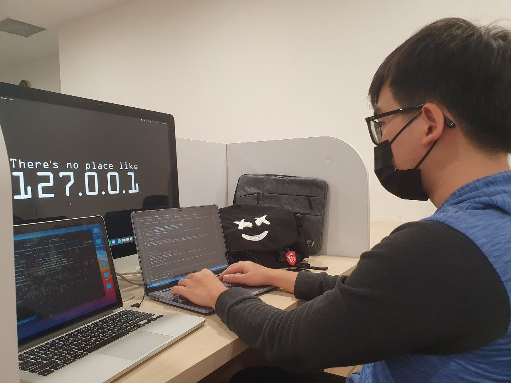
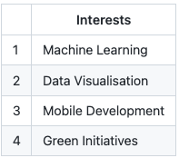

## <p> Nice to meet you, I'm Henry 👋 </p> <p align="center">  </p> <p align="right">  I'm a Fullstack Developer 🧑‍💻</p>

## <p align="center"> <b>✨ [<i>My Portfolio</i>](http://google.com.sg) ✨</b> </p>
<!-- ### <p align="center"> ~ Motto: Always eager to learn ~ </p> -->
##### <p align="center"> #MachineLearning #FullStackEngineer #DataVisualisation </p>

#### <p> Currently: Studying | Part-Time | Looking for 1 year internship (Jan-Dec 2022) <br/><br/> Location: Singapore <br/><br/> Education: Singapore Institute of Technology <br/> Bachelor of Engineering with Honours in ICT (Software Engineering) </p>

<p align="center"></p>
<!-- | | Interests  |
| --- | --- |
| 1 | Machine Learning |
| 2 | Data Visualisation |
| 3 | Mobile Development |
| 4 | Green Initiatives | -->

### <p align="center"><b> Experiences </b></p>
#### <p align="center"> Automation Scripts {Web Scrapping, VBA} <br/> Web Development {PHP, JS, HTML, CSS} <br/> Framework {Vue, Angular, React, Flask} <br/> Database Management {MySQL, Postgres, MariaDB, SQLlite} <br/> Mobile Development {Ionic, Kotlin} <br/> Embedded Systems  {C, Arduino, TinyCircuits} <br/> Object Oriented Programming {C++, Java, Python} </p>

### <p align="center"><b>Github Commits</b></p>

[](https://git.io/streak-stats)


### Reach Me
[][1]
[][2]
[][3]
[][4]

[1]: https://t.me/henryLOL
[2]: https://api.whatsapp.com/send?phone=+6596876870
[3]: https://www.linkedin.com/in/yiphl/
[4]: https://discordapp.com/users/325171852202868747/

#### Special Thanks: 
```diff
@@ Love ones @@
@@ Thu Ya (Mentor) @@
@@ People that believed @@
```

#### <i>Interest</i> 
```['Coding', 'Spotify', 'Karaoke' , 'Mahjong' , 'Cycling' , 'Community Service']```

###### Credits <a href="https://www.flaticon.com/free-stickers/discord" title="discord stickers">Discord stickers created by Stickers - Flaticon</a> <a href="https://www.flaticon.com/free-stickers/telegram" title="telegram stickers">Telegram stickers created by Stickers - Flaticon</a> <a href="https://www.flaticon.com/free-stickers/whatsapp" title="whatsapp stickers">Whatsapp stickers created by Stickers - Flaticon</a> <a href="https://www.flaticon.com/free-stickers/linkedin" title="linkedin stickers">Linkedin stickers created by Stickers - Flaticon</a>

<!--
**SageSG/SageSG** is a ✨ _special_ ✨ repository because its `README.md` (this file) appears on your GitHub profile.
-->

<!-- ```diff
- text in red
+ text in green
! text in orange
# text in gray
@@ text in purple (and bold)@@
``` -->
